#  E-commerce Website
E-commerce web application built using php routing. Instead of relying on the web server to map the request path to a file, all requests are forwarded to [index.php](/src/index.php) which has defined routes and callbacks registered to each route. If the request URI is a valid route, the callback returns a page to the user else, redirected to the 404 page.

[Live Demo](https://web.archive.org/web/20220907155514/https://tomiwa.com.ng/yemyem/)

## Features
- Login and registration system
- Password reset
- Ordering system
- Update profile
- Order history
- CSRF protection
- Input sanitisation
- Sends invoice to user's email using ([sendgrid](https://sendgrid.com))
- Livechat ([intercom](https://intercom.com))
    #### Admin Panel
- Create, modify and delete products, customers and faq
- Unlimited product pictures
- Image compression ([php_gd](https://php.net/manual/en/book.image.php)): 50%
- Image magic bytes verification
- Create or select product category
- Export/Import database
- Last 7 days sales and revenue stats using Chartjs
- Modify contact details and privacy policy
- Send email to users ([sendgrid](https://sendgrid.com))

## Setup
- Create database
- Execute [db-settings.sql](src/db-settings.sql)
- Enter database config [db.php](src/views/db.php)
- Enter sendgrid API key https://github.com/Tomiwa-Ot/e-commerce/blob/acb88e8d885feb9ed462242da9d4361c19755041/src/views/admin/util.php#L5
- Enter intercom app id https://github.com/Tomiwa-Ot/e-commerce/blob/acb88e8d885feb9ed462242da9d4361c19755041/src/views/footer.php#L86 https://github.com/Tomiwa-Ot/e-commerce/blob/acb88e8d885feb9ed462242da9d4361c19755041/src/views/footer.php#L101
- Enter your sendrid domain https://github.com/Tomiwa-Ot/e-commerce/blob/237b20b500e685424939499d3dabc8aaa49c8ee5/src/views/admin/util.php#L20 https://github.com/Tomiwa-Ot/e-commerce/blob/d869b3605ccbd46c39c6abf0aad6a2746dd0a275/src/views/cart.php#L20
- Enable the php_gd/gd extension in php.ini

## Admin Credentials
```
uri: /admin/login
username: admin
password: 123456
```

## Screenshots
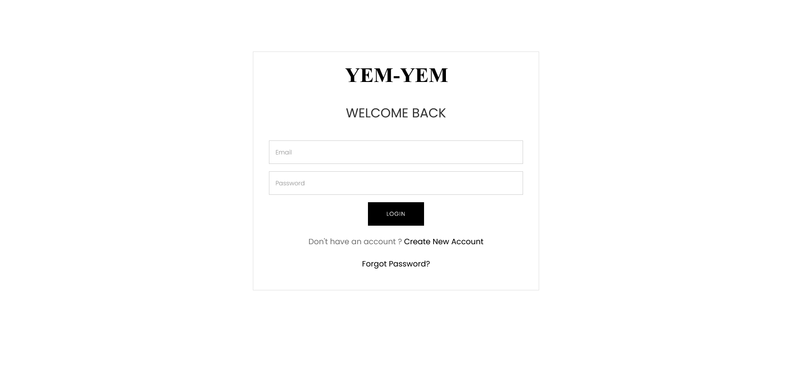
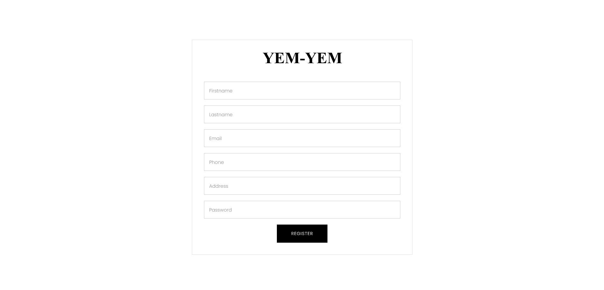
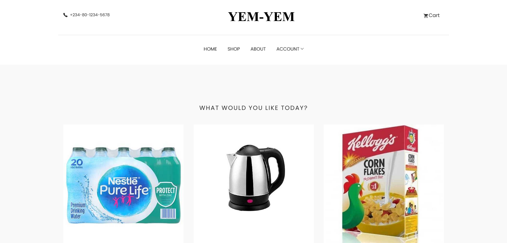
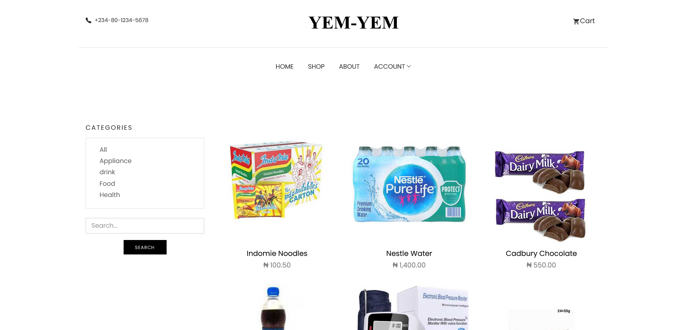
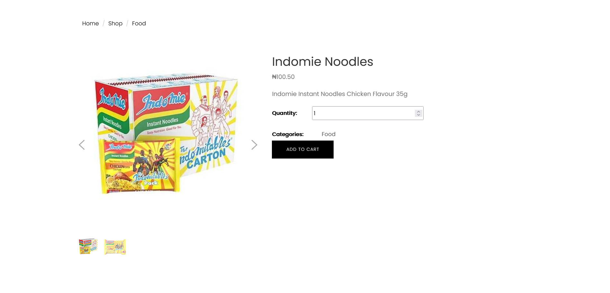
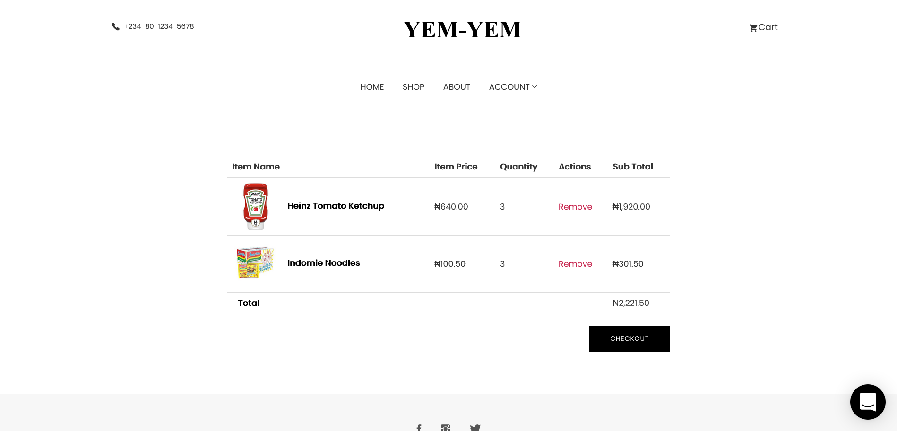
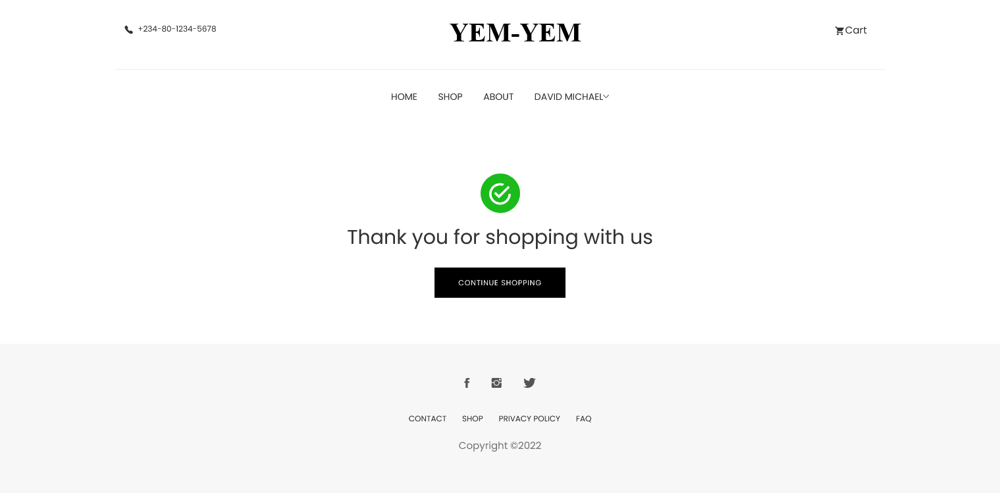
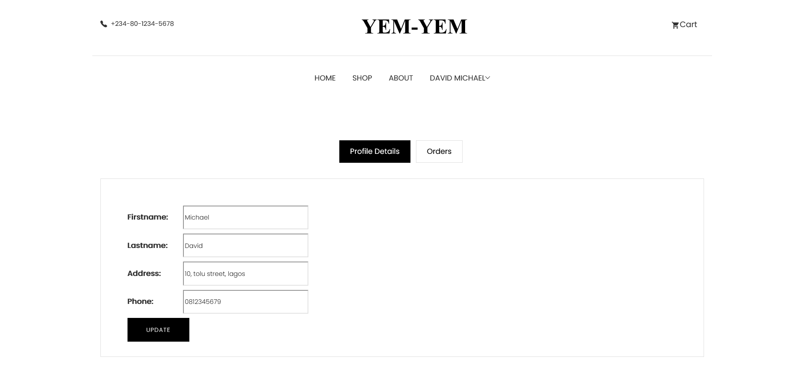
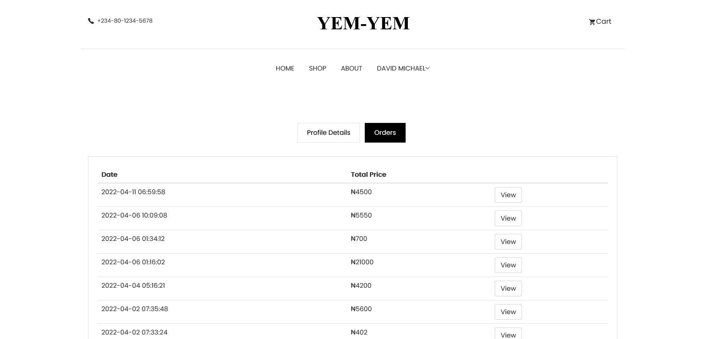
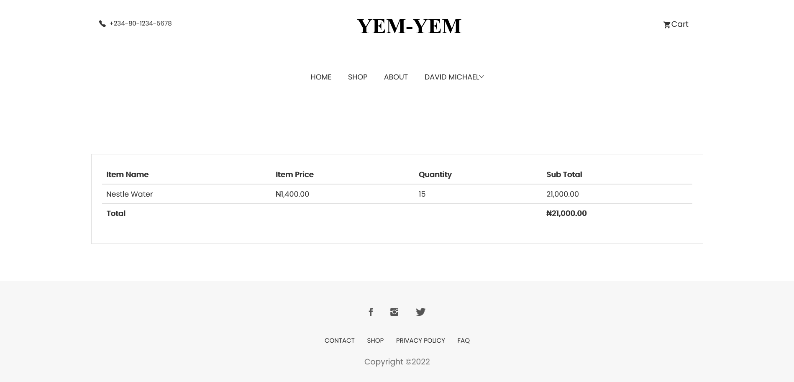

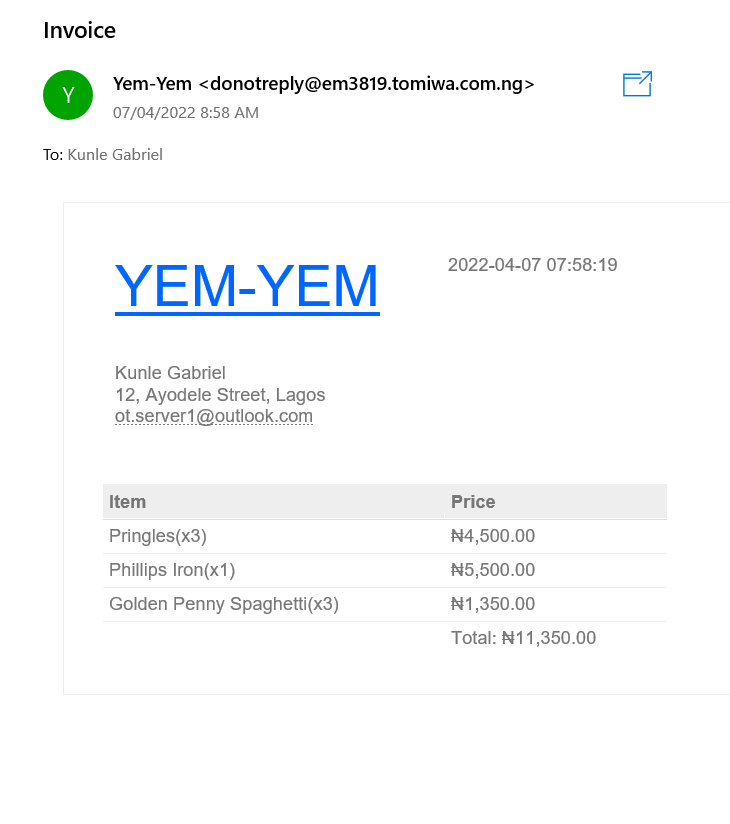
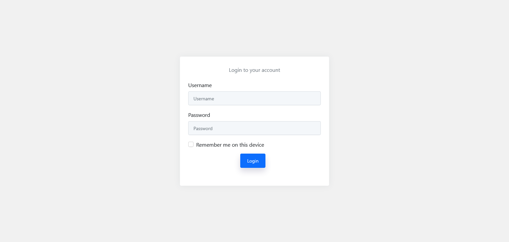
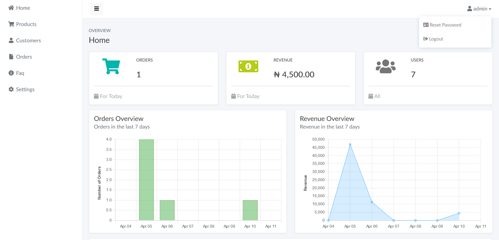
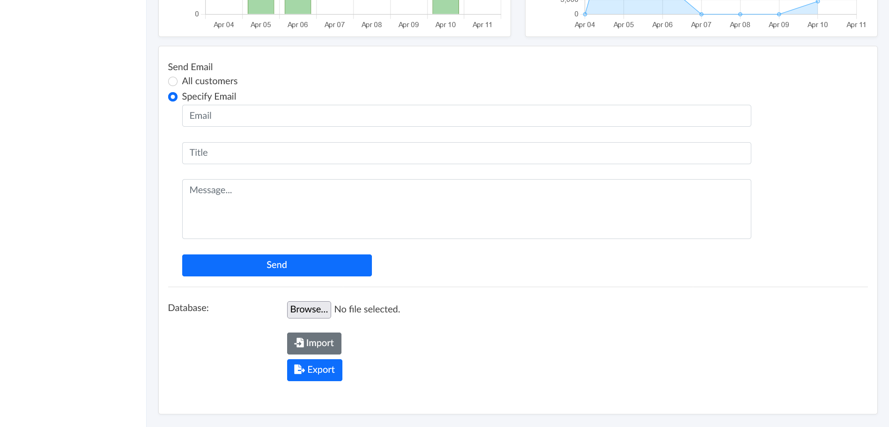

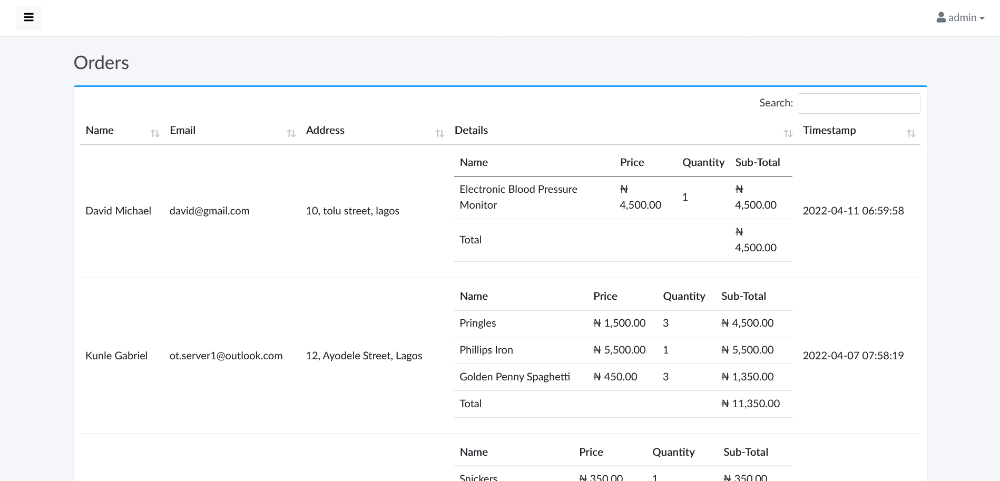
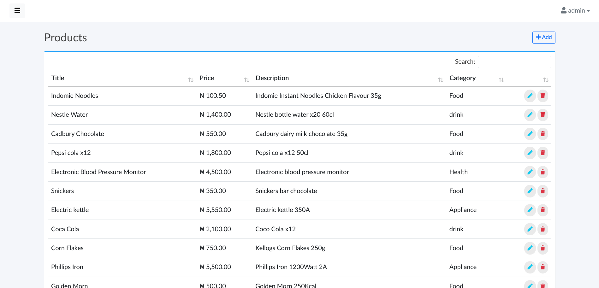
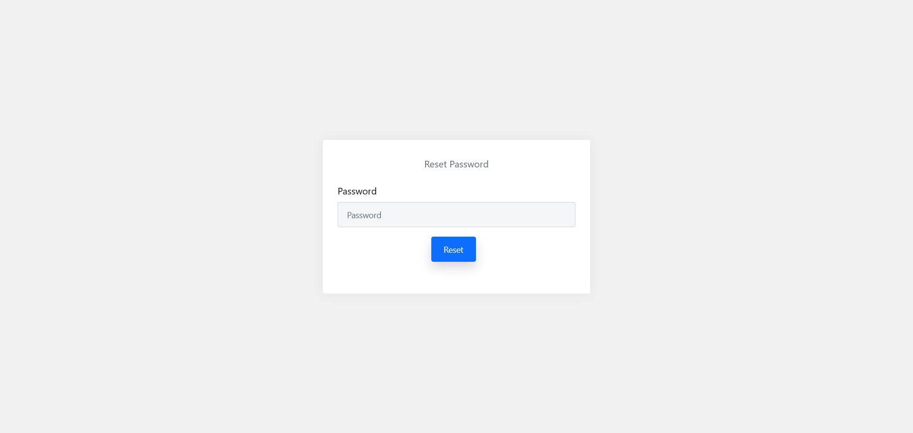
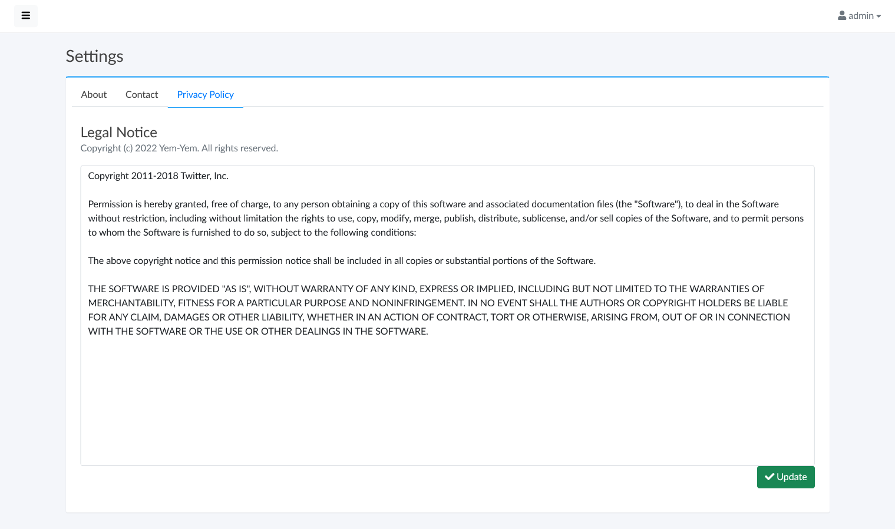
